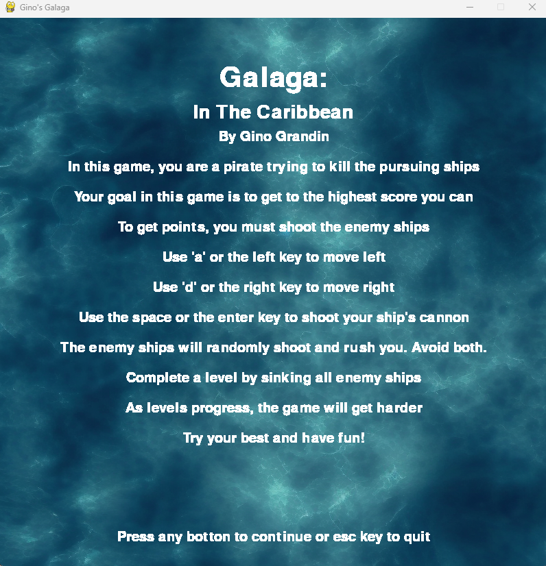
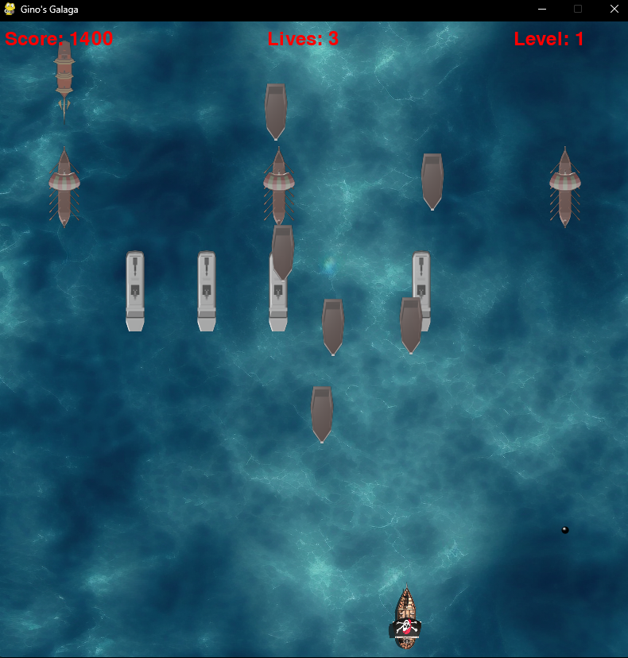

# Caribbean Crime Scene Galaga

A custom arcade-style shooter inspired by the classic *Galaga*, reimagined with a unique Caribbean crime scene theme.

## Overview

This project is a fast-paced 2D shooter where the player controls a ship to eliminate waves of enemies while avoiding incoming attacks. The game introduces custom visuals, themed enemies, and modified gameplay mechanics to create a fresh take on a classic arcade experience.

> Originally developed as part of a university project. I independently implemented and refined the core gameplay systems and later adapted the project for portfolio presentation.

---

##  Features

* Player-controlled movement and shooting mechanics
* Enemy wave system with increasing difficulty
* Collision detection and scoring system
* Custom theme and visual design
* Game loop with win/lose conditions

---

##  Tech Stack

* Language: Python
* Graphics/Framework: Pygame
* Version Control: Git & GitHub

---

##  Screenshots






---

##  How to Run
```bash
# Clone the repo
git clone https://github.com/YOUR_USERNAME/Caribbean-Crime-Scene-Galaga.git
cd Caribbean-Crime-Scene-Galaga

# Create virtual environment
python -m venv venv

# Activate it
source venv/bin/activate   # On Windows: venv\Scripts\activate

# Install dependencies
pip install -r requirements.txt

# Run the game
python main.py
```

---

## What I Learned

* Implementing real-time game loops and event handling
* Managing object interactions and collision detection
* Structuring a larger project for maintainability
* Debugging gameplay logic and performance issues

---

## Future Improvements

* Improve enemy AI behavior
* Add levels or boss mechanics
* Polish UI and menus

---

## Author

**GinoGr**
GitHub: https://github.com/GinoGr

---